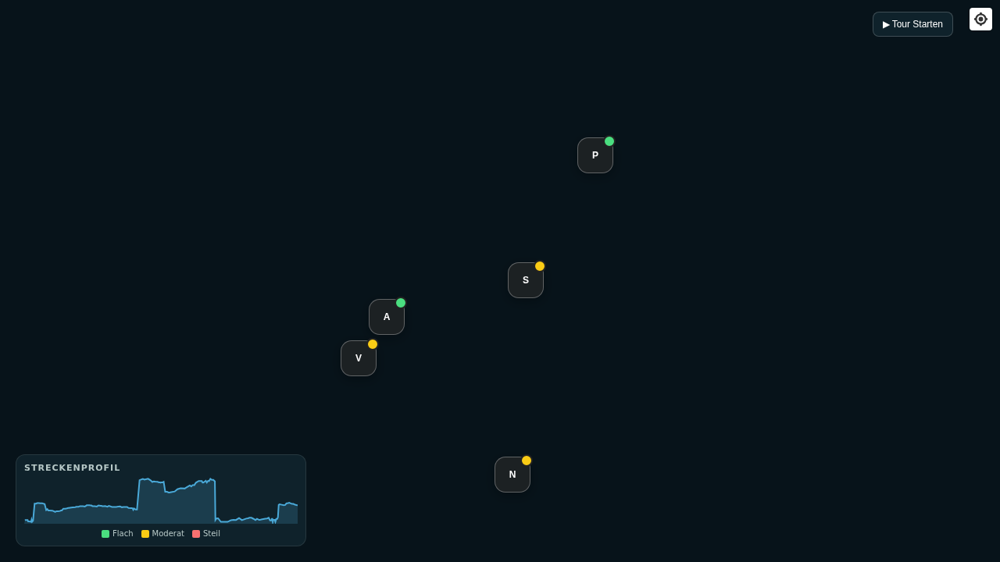

# 🏔️ Blindsee 3D Reality Map

Eine interaktive, mobile-optimierte 3D-Reliefkarte und ein digitaler Bergführer für den **Blindsee** in Tirol (Österreich) – entwickelt mit MapLibre GL JS, Geländerelief-Terrain und hochauflösenden Satellitendaten.



## ✨ Features

- **Echtes 3D-Geländerelief:** Authentische alpine Topografie der Grubigstein- und Zugspitz-Region mit dynamischer Höhenüberhöhung und Sonnenstand-Beleuchtung.
- **Interaktiver Tour-Assistent:** 4-stufiger Tourenberater abgestimmt auf Zielgruppe (Kinderwagen, Familie, Wanderer, mit Hund), gewünschte Streckenlänge und Interessenschwerpunkte.
- **4 kuratierte Routen:**
  1. *Uferspaziergang Bootshaus* (1.8 km · kinderwagentauglich)
  2. *Familien-Strandrunde* (3.4 km · Badespaß & Kiesstrand)
  3. *Großer Blindsee-Rundweg* (5.2 km · klassische Seeumrundung)
  4. *Panorama-Runde Zugspitzblick* (7.2 km · Alpin mit Fernpass-Aufstieg)
- **11 Hotspots & Realitäts-Ground-View:** Detaillierte Infos zu Badestellen, Tauchspots (*Versunkener Wald*), geologischen Muren, Mauttarifen und Infrastruktur inklusive Vor-Ort-Fotoansicht.
- **3D-Kamera-Rundflug:** Vollautomatischer dynamischer Flugmodus entlang der Seeroute.
- **Offline- & Mobile-optimiert:** Eigenständig lauffähig in WebCode / mobilem Browser auf Android.

## 🚀 Schnellstart

Öffne einfach [`index.html`](index.html) direkt im Browser oder über einen lokalen Webserver:

```bash
# Lokaler HTTP-Server starten
python3 -m http.server 8088

# Im Browser aufrufen
http://127.0.0.1:8088/index.html
```

## 🛠️ Aufbau

- `index.html` – Hauptanwendung (Standalone Single-Page Web App)
- `blindsee_3d_familienkarte.html` – Standalone-Familienkarte
- `build_map.py` – Python-Generatorskript zur Verarbeitung von OSM-Geodaten & DEM-Höhenprofilen
- `blindsee_data.json` & `overpass_blindsee.json` – Gecachte Vektor- und POI-Rohdaten

## 📄 Lizenz
MIT License
